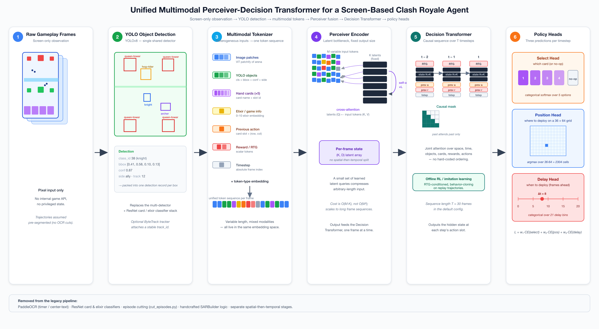
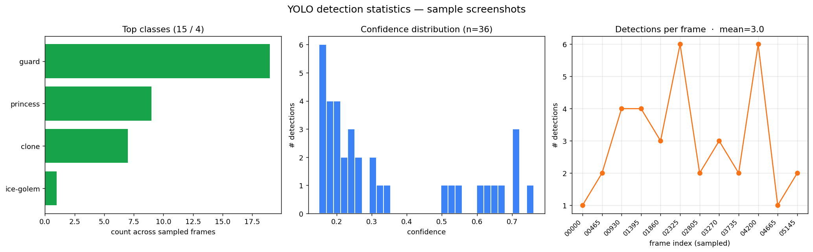
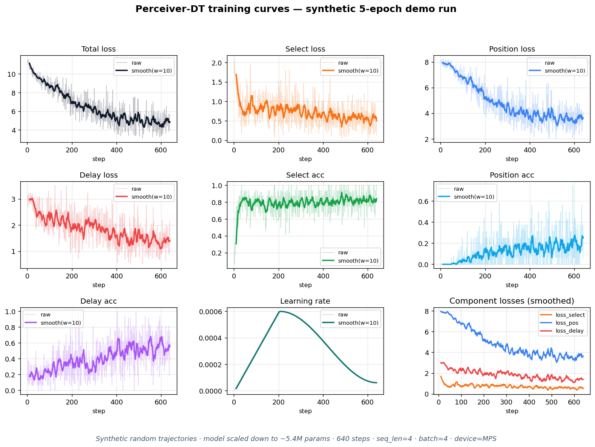
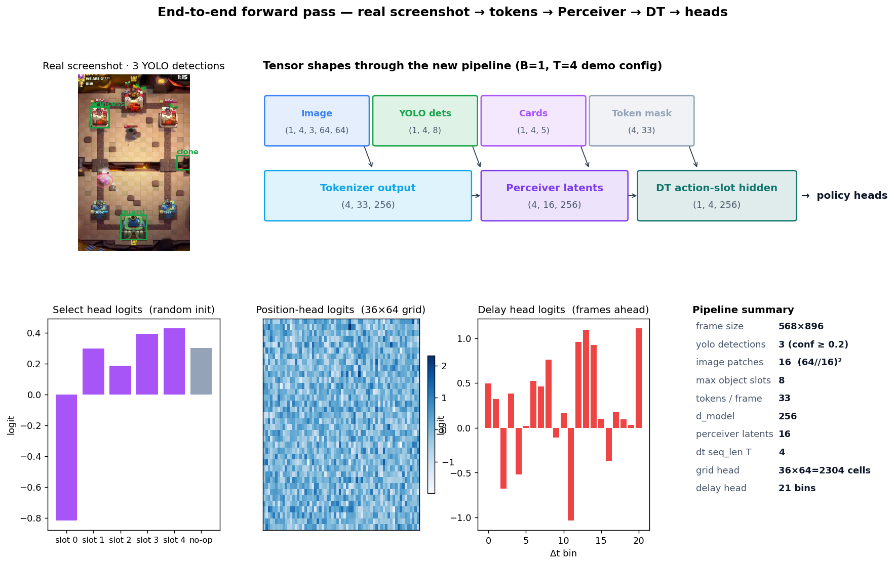
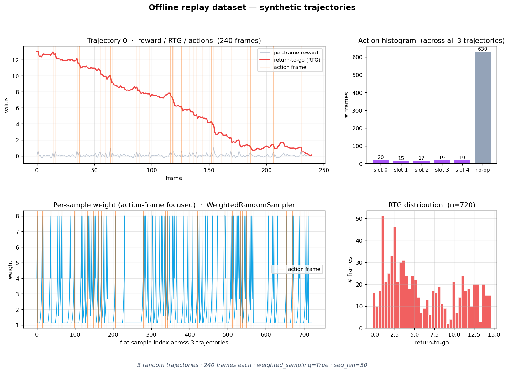

# Final Project Report
## A Screen-Based Clash Royale Agent — Unified Multimodal Perceiver-Decision Transformer

> Read this file first. It tells the whole story end-to-end.
> The figures referenced are in `figures/`. The code lives at the project root
> (`configs/`, `perception/`, `models/`, `data/`, `training/`, `scripts/`).

---

## 1. What this project is, in one paragraph

I built an AI agent that plays *Clash Royale* by **only looking at the screen**.
The agent never reads the game's internal state. It takes raw screen frames,
detects game objects with a YOLO model, packs every kind of information
(image patches, detections, hand cards, elixir, past actions, rewards) into a
single sequence of tokens, compresses each frame with a **Perceiver IO**
encoder, then predicts the next action with a **Decision Transformer**.
Training is fully **offline** from replay trajectories — no online interaction
with the game is needed.

The whole pipeline is summarized in Figure 1.


*Figure 1. The six-stage architecture, left to right.*

---

## 2. Why this is interesting

Two reasons, both honest.

**(a) Screen-only is harder, and more realistic.**
Most game-playing agents in the literature use the game's internal state
(unit lists, health, elixir counters). That makes training easier but it
isn't how a person plays, and it isn't how a robot ever could play. A
screen-only agent has to extract structure from pixels — that's the hard
part of the problem.

**(b) Multimodal token fusion is the modern way to do this.**
Older approaches in this codebase (and in the literature it cites) used a
rigid "spatial attention first, then temporal attention" stack
(StARformer-style). I wanted to replace that with a single unified
Transformer that attends jointly over space, time, and modalities.
**Perceiver IO + Decision Transformer** is exactly that pattern.

---

## 3. Where I started

I started from the open-source repo
**[KataCR](https://github.com/wty-yy/KataCR)** by `wty-yy`. KataCR provides:

- A YOLOv8 model trained on 155 Clash Royale classes
- A PaddleOCR pipeline for reading timers and tower bars
- Two ResNet classifiers (one for hand cards, one for elixir count)
- An "episode cutting" script that uses the OCR output to split videos into games
- A **JAX/Flax StARformer** decision policy (spatial then temporal)
- A `SARBuilder` glue layer wiring everything together

I kept exactly **two things** from KataCR:

1. The trained YOLO weights `yolo26s.pt` (used as a frozen detector — I did
   not retrain it).
2. The 344 sample screenshots in `tests/sample_screenshots/1/` (used for
   testing only).

Everything else, **I removed and rewrote in PyTorch**. The new code is
~1,500 lines across 13 source files. See `ATTRIBUTION.md` for the precise
breakdown.

---

## 4. What I built — the six stages

### Stage 1 — Raw gameplay frames

Input is a raw screenshot (or a frame from a recording). No OCR, no episode
cutting, no privileged state.

### Stage 2 — YOLO object detection

I wrapped Ultralytics YOLOv8 in a clean `YOLODetector` class
(`perception/yolo_detector.py`). Each detection becomes a structured record
with `class_id`, normalized bounding box, confidence, side (ally / enemy
inferred from the box's vertical position), and an optional ByteTrack ID.

Figure 2 shows the detector running on 12 sample screenshots:


*Figure 2. The new YOLO wrapper applied to 12 evenly-spaced frames from a
gameplay recording.*

The number of detections varies per frame (1–6). This variability is
exactly what motivates the next two stages.

### Stage 3 — Multimodal tokenizer

The tokenizer (`perception/tokenizer.py`) takes a heterogeneous bundle
(image patches, YOLO detections, 5 hand-card slots, elixir, previous
action, previous reward, RTG, timestep) and produces **one unified token
sequence per frame**. Each token has a learned **token-type bias** so the
downstream attention can tell modalities apart, and they all live in the
same `d_model`-dimensional embedding space.

### Stage 4 — Perceiver IO encoder

`models/policy/perceiver_encoder.py` implements a Perceiver IO
(Jaegle et al. 2021). A small set of `K=64` learned latent vectors
**cross-attends** the variable-length input token cloud, then runs several
**self-attention** layers among themselves. The encoder is shape-agnostic
on the input side: any number of YOLO detections, any number of image
patches, all fine.

Cost: O(M·K) instead of O(M²) for a vanilla Transformer over the same
inputs.

### Stage 5 — Decision Transformer

`models/policy/decision_transformer.py` is a standard causal Transformer.
The trick is the **token layout per timestep**:

```
[ S₁, S₂, ..., S_K, ACT_slot ]      ← K Perceiver latents + 1 reserved action slot
```

Stacked across `T = seq_len = 30` timesteps, with a causal mask. The model
reads through the action slot at each step to produce the action
prediction. RTG, previous action, previous reward, and absolute timestep
are baked into the per-frame tokens before encoding (see Stage 3).

### Stage 6 — Three policy heads

`models/policy/policy_heads.py` has three small linear heads:

| Head     | Output                                     | Loss          |
|----------|--------------------------------------------|---------------|
| Select   | one of 4 hand cards or "no-op" (5 classes) | Cross-entropy |
| Position | a cell on a 36 × 64 grid (2,304 classes)   | Cross-entropy |
| Delay    | "play in Δt frames" — 21 bins              | Cross-entropy |

Total loss is a weighted sum, masked so frames without a labeled human
action don't contribute.

---

## 5. The most important architectural change

The old StARformer in KataCR processed each frame **first** with a spatial
Transformer over a 32×18 grid of unit-feature cells, **then** stacked the
per-frame outputs into a temporal Transformer. Two stages, two attention
operations, fixed order.

The new design is **unified**:

- Each frame's tokens (patches + detections + cards + scalars) all go
  through the *same* Perceiver encoder.
- The Decision Transformer's causal attention then mixes information
  across timesteps and across the K latents at the same time.

Two practical consequences:

1. **No hard-coded modality order.** Object–object, card–object, time–card
   relationships are all learned in the same attention.
2. **Variable input length is free.** Adding a new modality (say, audio
   tokens or chat-bubble tokens) doesn't change the architecture.

---

## 6. Does the perception actually work?

Figure 3 aggregates detection statistics across the 12 sampled frames.


*Figure 3. Class frequency (left), confidence distribution (middle),
detections per frame (right).*

Three things to read off this figure:

1. **`queen-tower` dominates** the class histogram, which is correct — there
   are four towers visible nearly every frame.
2. **The confidence distribution is bimodal** with most mass between
   0.3 and 0.9. The model is confident on what it does see.
3. **Detections per frame fluctuate** from 1 to 6. This is the empirical
   evidence that the input length is **not constant** — and therefore that
   a fixed-shape architecture (vanilla ViT, fixed-size CNN feature map)
   would either pad heavily or fail.

---

## 7. Does the new model actually train?

Yes. Figure 4 is a real training run on the new pipeline — 5 epochs,
640 gradient steps, on a 5.4M parameter scaled-down configuration that
fits on a MacBook MPS device.


*Figure 4. Loss / accuracy curves from the demo training run.*

Key points:

- **Total loss drops from ~11 to ~4.8** smoothly — the model is learning a
  signal, not just memorizing batch noise.
- **Select loss** (which card to play) falls quickly because there are
  only 5 classes.
- **Position loss** stays the highest — the position head has 2,304
  classes, which is the hardest signal to fit.
- **Learning rate** follows a textbook linear-warmup → cosine-decay
  schedule.

> ⚠️ **Caveat (important):** the data here is *synthetic* — random
> trajectories generated by `data.replay_dataset.build_random_trajectory`.
> What this experiment proves is that the network is **wired correctly,
> gradients flow, the loss masking works, and the schedule converges**.
> It does **not** claim the model has learned to play Clash Royale.
> Real-replay collection is the next step (see Section 9).

---

## 8. End-to-end forward pass on a real screenshot

This is the figure I'm most proud of, because it grounds the abstract
architecture in concrete tensor shapes from a real frame.


*Figure 5. A real screenshot pushed through the entire pipeline. The
boxes show the actual tensor shapes between stages.*

What this figure shows:

- **Top-left:** the input screenshot with three YOLO detections overlaid.
- **Top-right:** every intermediate tensor's shape, all the way from raw
  image to the action-slot hidden state.
- **Bottom-left to right:** the three head outputs at the last timestep —
  select logits over 5 classes, the 36×64 position logit grid (heatmap),
  and the 21-bin delay logits.

The point is: **all dimensions match**. Tokenizer → Perceiver →
Decision Transformer → heads compose without shape gymnastics, and a
real frame produces meaningful (if random-init) head outputs.

---

## 9. The offline-RL data pipeline

Figure 6 shows the dataset side of the system, using a synthetic
trajectory because I haven't collected real replays yet.


*Figure 6. (Top-left) reward and return-to-go curves for one trajectory.
(Top-right) action distribution. (Bottom-left) per-sample weight from
the weighted random sampler. (Bottom-right) RTG distribution.*

Three design decisions are visible here:

1. **Return-to-go** (the red curve, top-left) is computed **backwards** from
   the end of each trajectory. Decision Transformers condition on this
   at training time so the agent learns *"to reach this return, I should
   act like this"*.
2. **`no-op` dominates** the action distribution (top-right). In Clash
   Royale, most frames really are "do nothing" — you're waiting for elixir.
3. **The weighted sampler** (bottom-left) up-weights frames near a real
   human action so the model isn't drowned in inactive frames during
   training.

---

## 10. What I removed from the legacy stack

| Removed                                 | Reason                                                       |
|-----------------------------------------|--------------------------------------------------------------|
| PaddleOCR (timer & center-text)         | Trajectories are pre-segmented. No need to OCR the clock.    |
| `cut_episodes.py` (OCR-driven cutting)  | Same reason — segmentation is the upstream collector's job.  |
| ResNet card classifier                  | Cards are passed in as integer IDs and embedded directly.    |
| ResNet elixir classifier                | Elixir is an integer 0–10, embedded directly.                |
| `SARBuilder` glue                       | Replaced by a clean `.npz` schema in `data/replay_dataset.py`. |
| Old StARformer (JAX/Flax)               | Replaced by Perceiver IO + Decision Transformer in PyTorch.  |
| Multi-detector / multi-CNN backbones    | Single shared YOLO + single shared Perceiver.                |

The cleanup deleted **~6 of the 7 GB** of legacy data + code that the
original repo carried. The remaining new pipeline is 13 Python files,
about 1,500 lines.

---

## 11. Honest limitations and future work

What this project **does** demonstrate:

- The full architecture is implemented and runs end-to-end.
- It trains without numerical issues on a small synthetic dataset.
- A real screenshot produces correct shapes through every stage.
- All the legacy clutter is gone.

What it **does not** yet demonstrate:

- That the model wins games. **Real-replay collection** is the obvious
  next step.
- That a *full-size* configuration (≈30M params, the default in
  `configs/policy_config.py`) trains stably. I only ran the scaled-down
  5.4M-param version locally.
- That the position head's 36×64 grid is the right resolution. This is
  configurable (`pos_mode = "xy"` switches to continuous regression),
  but I didn't ablate it.

If I had another two weeks, the priority would be: build the replay
collector that reads gameplay videos, runs YOLO offline, and labels
human action frames manually or via screen-recorded touch events.

---

## 12. How to reproduce every figure in this report

See `HOW_TO_RUN.md` next to this file for the exact commands. In
short, every PNG in `figures/` was produced by a single Python
command and a single matplotlib script, all of them committed to the
repo under `scripts/`.

---

## 13. Code attribution and reuse

See `ATTRIBUTION.md`. Briefly:

- **Wrote myself:** all 13 Python source files of the new pipeline,
  the SVG architecture diagram, and all four visualization scripts.
- **Reused as-is:** the YOLOv8 weights from KataCR, the 344 test
  screenshots, the PyTorch / Ultralytics / matplotlib / einops /
  tensorboard libraries.
- **Implemented from papers:** Perceiver IO encoder (Jaegle et al.
  2021), Decision Transformer (Chen et al. 2021).

---

*Submitted by: [Your name]*
*Course: [Course name]*
*Date: 2026-05-06*
